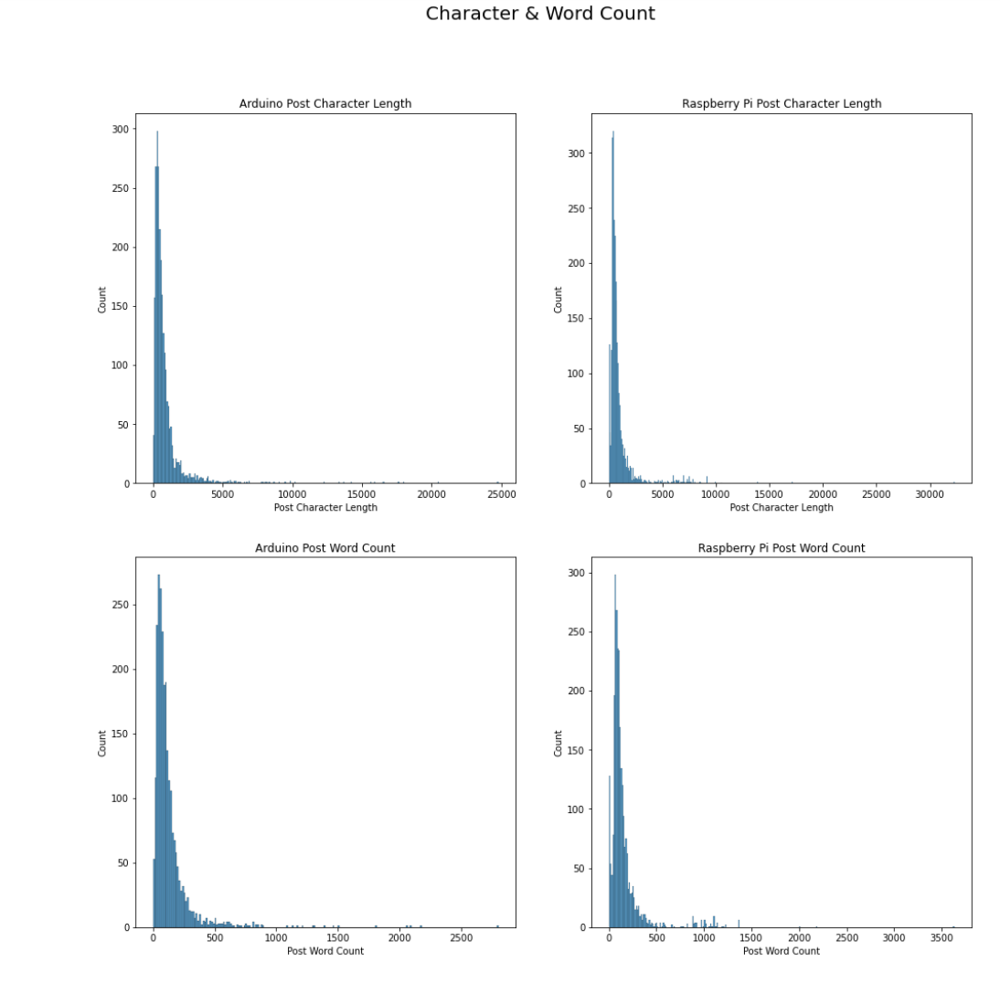
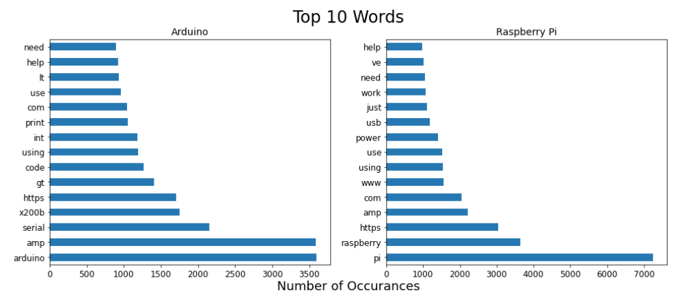
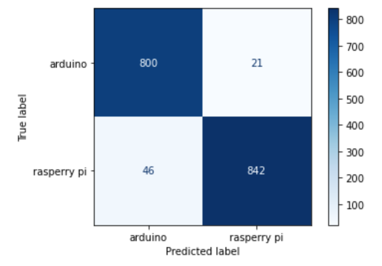
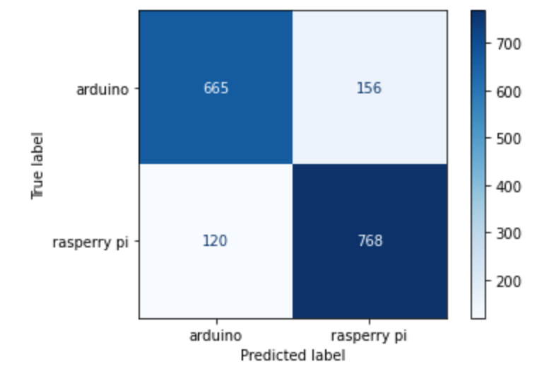
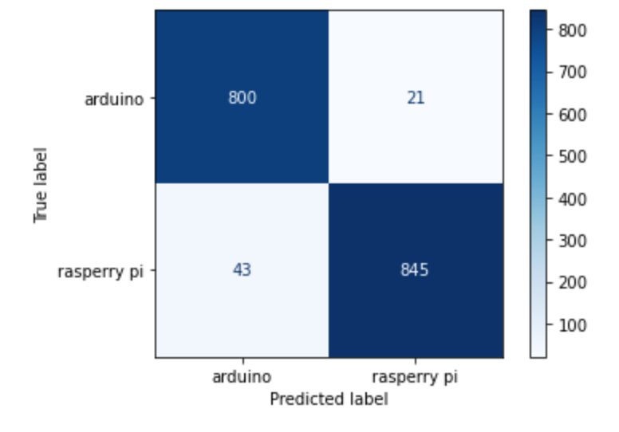
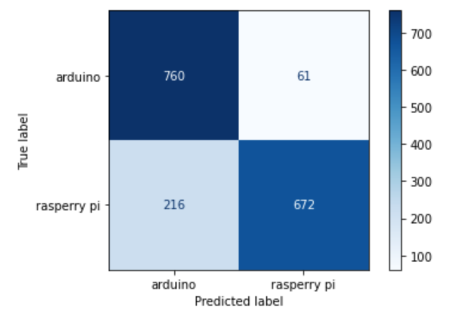

# Project 3: Web APIs & NLP

---
## Executive Summary
Maker Faire is one of the world's largest organizations for DIY, hobbyists, tech and electronics enthusiasts and so much more. The conferences are one of the best places to explore and learn new and exciting things from people all over. The challenge is as great as Maker Faire conferences are, you've been having issues retaining attendees over the past 2 years.

Maintaining rentention rates year over year is important. Conferences bring in a lot of money for organizations and builds brand loyalty. What you need is a way to collect attendees information and provide a fun and interative way to connect with the Maker Faire brand personally. This is a major way to increasing retention rates for conferences.

You're in luck as we've developed a machine learning algorithm just for that. Here at Osborne AI, we've developed a natural language processing algorithm to create fun experiences for conferences. Knowing that Arduino's and Raspberry Pi's are big parts of the Maker Faire conferences, we've created an that algorithm allows attendees to input text and based on the text they've inputed the algorithm determines which device attendees are a fan of. This algorithm can be easily integrated into your already exisiting application. Our algorithm focuses on being as accurate as possibly with over a 96% accuracy rating.

With this solution, we aim to grow your retention rating by 20% over the next year.

Here at Osborne AI, we're proud to be machine learning experts. This means we've have a team of highly skilled and intelligent Data Scientists, with a focus on helping brands thrive. We have a track record of enhancing customer experiences with 5 star ratings from previous clients.

At Osborne AI we love working with organizations such as Maker Faire. As hobbyist and technology enthusiasts ourselves working with Maker Faire would be an honor. Our partnership can transform future conferences to come.

If you're ready to increase your retention rates for years to come, we're ready to hit the ground running.

This proposal outlines in more detail our process for developing our algorithm and what you can expect from our team.

---

## Problem Statement

Maker Faire Conference wants to do a fun interactive app for their attendees at the upcoming conference. For the attendees who are fans of Arduinos and Raspberry Pi they want to build a classification model that will identify which person is a fan of either device based on the text they enter into the app. The goal of the model is to be as accurate as possible. The hope for this project is to delight the attendees and retain attendence for future conferences.

---

## Data Dictionary
|Feature|Type|Dataset|Description|
|---|---|---|---|
|**subreddit**|*object*|Reddit Subreddit Data|Name of subreddit|
|**title**|*object*|Reddit Subreddit Data|Title of subreddit post|
|**selftext**|*object*|Reddit Subreddit Data|Text of subreddit post body|

## Summary of Analysis
In my analysis I found the most accurate predictive model to answer the problem statement. I pulled subreddit data from r/arduino and r/raspberry_pi using the pushshift Reddit api wrapper. I tested and compared the accuracy scores of both Random Forest model and K-Nearest Neighbors model. For both models I tested them using Count Vectorization and TF-IDF Vectorization. My aim was to find the highest accuracy score amount the models.

Visuals from my exploratory analysis:

Confusion Matrix Plot of models:

Random Forest with Count Vectorization

K-Nearest Neighbors with Count Vectorization

Random Forest with TF-IDF Vectorization

K-Nearest Neighbors with Count Vectorization

## Conclusions and Recommendations

Overall the two Random Forest models performed the best out of all 4 models. The Random Forest model using the TF-IDF Vectorizer performed slightly better out of the two models. With the goal of accuracy in mind, I recommend using this model as the production model. It had an accuracy of 96.25% and made only 64 errors on the test set.

Some potential models to explore for improving the accuracy rating would be to try other ensemble models such as AdaBoost, Gradient Boost, or XGBoost. Testing these three models against our best Random Forest Model could potentially produce better accuracy scores at prediciting subreddits.